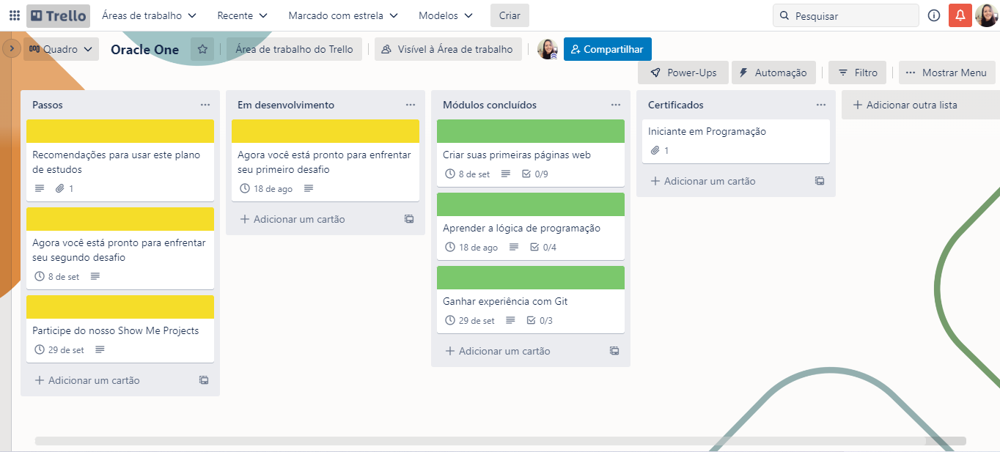

# Barbearia Alura

## Índice

- [1. Status do projeto](#1-status-do-projeto)
- [2. Acesso](#2-acesso)
- [3. Descrição](#3-descricao)
- [4. Planejamento](#4-planejamento)
- [8. Tecnologias utilizadas](#8-tecnologias-utilizadas)
- [9. Pessoas desenvolvedoras](#9-pessoas-desenvolvedoras)

## 1. Status do projeto

-  

## 2. Acesso

O deploy do projeto foi realizado pelo Git Pages. [Clique aqui](https://lidiannerb.github.io/Barbearia-Alura/) para acessá-lo.

### Como usar
Você precisará:

- Instalar o Node.js e clonar o projeto.
- Instalar as dependências:  npm install
- Iniciar a aplicação através do Live Server (extensão do VS Code) 

## 3. Descrição

O projeto consiste na criação de um site para uma barbearia, utilizando apenas CSS e HTML. 

Objetivos:

Entender a estrutura básica de um arquivo HTML
Utilizar o navegador para inspecionar elementos
Aprender a definir estilos para elementos usando o CSS
Desenvolver um página Web

## 4. Planejamento

## 8. Tecnologias utilizadas

- HTML 5
- CSS
- Node.JS

## 9. Pessoas desenvolvedoras

Este projeto foi desenvolvido durante o Bootcamp da Laboratória, Turma 007 pelas colaboradoras: 

- [Lidianne Barbosa](https://www.linkedin.com/in/lromao/)

